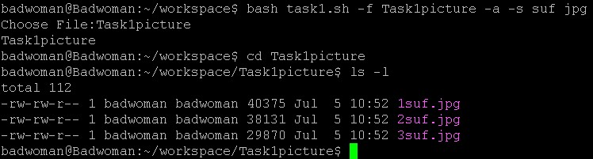
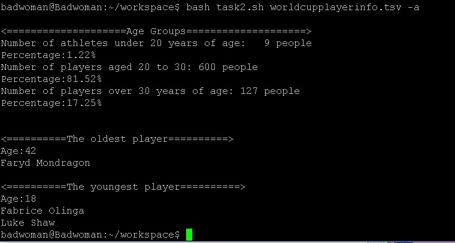
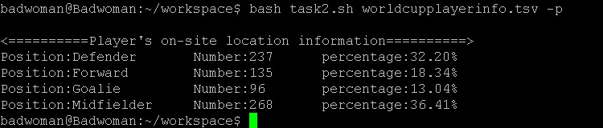
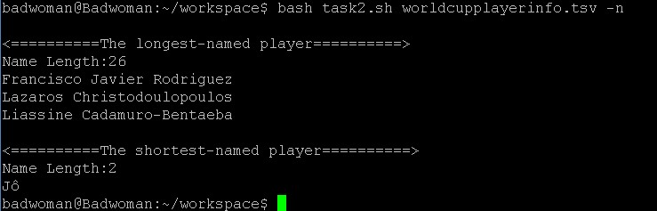

# 第四章：SHELL脚本编程基础（实验）

## 实验目标

- [x] 任务一：用bash编写一个图片批处理脚本，实现以下功能：

    - [x] 支持命令行参数方式使用不同功能

    - [x] 支持对指定目录下所有支持格式的图片文件进行批处理

    - [x] 支持以下常见图片批处理功能的单独使用或组合使用

        - [x] 支持对jpeg格式图片进行图片质量压缩

        - [x] 支持对jpeg/png/svg格式图片在保持原始宽高比的前提下压缩分辨率

        - [x] 支持对图片批量添加自定义文本水印

        - [x] 支持批量重命名（统一添加文件名前缀或后缀，不影响原始文件扩展名）

        - [x] 支持将png/svg图片统一转换为jpg格式图片

- [x] 任务二：用bash编写一个文本批处理脚本，对以下附件分别进行批量处理完成相应的数据统计任务：

    - [x] 统计不同年龄区间范围（20岁以下、[20-30]、30岁以上）的球员数量、百分比

    - [x] 统计不同场上位置的球员数量、百分比

    - [x] 名字最长的球员是谁？名字最短的球员是谁？

    - [x] 年龄最大的球员是谁？年龄最小的球员是谁？

- [x] 任务三：用bash编写一个文本批处理脚本，对以下附件分别进行批量处理完成相应的数据统计任务：

    - [x] 统计访问来源主机TOP 100和分别对应出现的总次数

    - [x] 统计访问来源主机TOP 100 IP和分别对应出现的总次数

    - [x] 统计最频繁被访问的URL TOP 100

    - [x] 统计不同响应状态码的出现次数和对应百分比

    - [x] 分别统计不同4XX状态码对应的TOP 10 URL和对应出现的总次数

    - [x] 给定URL输出TOP 100访问来源主机

## 实验环境

- VirtualBox

- ubuntu-18.04.1-server-amd64

### 任务一

- 帮助信息

    

- 支持对jpeg格式图片进行图片质量压缩

         bash task1.sh -f 文件 -j 图片不能超过的大小 高 宽 压缩图片质量

    

- 支持对jpeg/png/svg格式图片在保持原始宽高比的前提下压缩分辨率

         bash task1.sh -f 文件 -cr 压缩分辨率

    

- 支持对图片批量添加自定义文本水印

         bash task1.sh -f 文件 -w 水印内容

    

    

    
    

- 支持批量重命名（统一添加文件名前缀或后缀，不影响原始文件扩展名）

         bash task1.sh -f 文件或文件夹路径 -a -p 前缀 图片类型

         bash task1.sh -f 文件或文件夹路径 -a -s 后缀 图片类型

    
    

- 支持将png/svg图片统一转换为jpg格式图片

         bash task1.sh -f 文件或文件夹路径 -t
         失败了

### 任务二

- 帮助信息

    

- 统计不同年龄区间范围（20岁以下、[20-30]、30岁以上）的球员数量、百分比/年龄最大的球员是谁？年龄最小的球员是谁？

    

- 统计不同场上位置的球员数量、百分比

    
- 名字最长的球员是谁？名字最短的球员是谁？
    

### 任务三

- 帮助信息

    

- 统计访问来源主机TOP 100和分别对应出现的总次数

        <========================Source host TOP 100========================>
        Source host: edams.ksc.nasa.gov                          Number: 6530
        Source host: piweba4y.prodigy.com                        Number: 4846
        Source host: piweba5y.prodigy.com                        Number: 4607
        Source host: piweba3y.prodigy.com                        Number: 4416
        Source host: news.ti.com                                 Number: 3298
        Source host: intgate.raleigh.ibm.com                     Number: 3123
        Source host: mpngate1.ny.us.ibm.net                      Number: 3011
        Source host: e659229.boeing.com                          Number: 2983
        Source host: piweba1y.prodigy.com                        Number: 2957
        Source host: webgate1.mot.com                            Number: 2906
        Source host: beta.xerox.com                              Number: 2318
        Source host: poppy.hensa.ac.uk                           Number: 2311
        Source host: vagrant.vf.mmc.com                          Number: 2237
        Source host: palona1.cns.hp.com                          Number: 1910
        Source host: koriel.sun.com                              Number: 1762
        Source host: trusty.lmsc.lockheed.com                    Number: 1637
        Source host: gw2.att.com                                 Number: 1623
        Source host: cliffy.lfwc.lockheed.com                    Number: 1563
        Source host: inet2.tek.com                               Number: 1503
        Source host: disarray.demon.co.uk                        Number: 1485
        Source host: gw1.att.com                                 Number: 1467
        Source host: interlock.turner.com                        Number: 1395
        Source host: sgigate.sgi.com                             Number: 1354
        Source host: bocagate.bocaraton.ibm.com                  Number: 1336
        Source host: piweba2y.prodigy.com                        Number: 1324
        Source host: gw3.att.com                                 Number: 1311
        Source host: keyhole.es.dupont.com                       Number: 1310
        Source host: n1144637.ksc.nasa.gov                       Number: 1297
        Source host: erigate.ericsson.se                         Number: 1216
        Source host: gn2.getnet.com                              Number: 1211
        Source host: gwa.ericsson.com                            Number: 1089
        Source host: tiber.gsfc.nasa.gov                         Number: 1079
        Source host: bstfirewall.bst.bls.com                     Number: 1017
        Source host: spider.tbe.com                              Number: 1013
        Source host: gatekeeper.us.oracle.com                    Number: 1010
        Source host: whopkins.sso.az.honeywell.com               Number: 984
        Source host: news.dfrc.nasa.gov                          Number: 966
        Source host: proxy0.research.att.com                     Number: 940
        Source host: proxy.austin.ibm.com                        Number: 925
        Source host: bbuig150.unisys.com                         Number: 901
        Source host: corpgate.nt.com                             Number: 899
        Source host: sahp315.sandia.gov                          Number: 890
        Source host: amdext.amd.com                              Number: 869
        Source host: n1121796.ksc.nasa.gov                       Number: 830
        Source host: igate.uswest.com                            Number: 825
        Source host: gatekeeper.cca.rockwell.com                 Number: 819
        Source host: wwwproxy.sanders.com                        Number: 815
        Source host: gw4.att.com                                 Number: 814
        Source host: goose.sms.fi                                Number: 812
        Source host: jericho3.microsoft.com                      Number: 805
        Source host: jericho2.microsoft.com                      Number: 786
        Source host: sdn_b6_f02_ip.dny.rockwell.com              Number: 782
        Source host: lamar.d48.lilly.com                         Number: 778
        Source host: heimdallp2.compaq.com                       Number: 772
        Source host: stortek1.stortek.com                        Number: 771
        Source host: mac998.kip.apple.com                        Number: 759
        Source host: tia1.eskimo.com                             Number: 742
        Source host: reddragon.ksc.nasa.gov                      Number: 715
        Source host: rmcg.cts.com                                Number: 701
        Source host: bambi.te.rl.ac.uk                           Number: 701
        Source host: electron.mcc.com                            Number: 697
        Source host: pinta.csee.usf.edu                          Number: 689
        Source host: n1040681.ksc.nasa.gov                       Number: 676
        Source host: gatekeeper.mitre.org                        Number: 670
        Source host: hpcvsop.cv.hp.com                           Number: 669
        Source host: screen.lotus.com                            Number: 667
        Source host: metabelis.rmit.edu.au                       Number: 666
        Source host: orpheus.amdahl.com                          Number: 657
        Source host: proxy.bellatlantic.com                      Number: 654
        Source host: n1376232.ksc.nasa.gov                       Number: 652
        Source host: n1131455.ksc.nasa.gov                       Number: 645
        Source host: n1123413.ksc.nasa.gov                       Number: 642
        Source host: zooropa.res.cmu.edu                         Number: 632
        Source host: fkirchman.gsfc.nasa.gov                     Number: 612
        Source host: theopolis.orl.mmc.com                       Number: 611
        Source host: n1123543.ksc.nasa.gov                       Number: 611
        Source host: ntigate.nt.com                              Number: 610
        Source host: pc24.ac.tandem.com                          Number: 606
        Source host: euas65.eua.ericsson.se                      Number: 596
        Source host: scooter.pa-x.dec.com                        Number: 592
        Source host: neuron.bms.com                              Number: 572
        Source host: ottgate2.bnr.ca                             Number: 569
        Source host: n1144796.ksc.nasa.gov                       Number: 569
        Source host: relay02.jpmorgan.com                        Number: 556
        Source host: duckling.omsi.edu                           Number: 556
        Source host: sophocles.algonet.se                        Number: 551
        Source host: ftp.mel.aone.net.au                         Number: 548
        Source host: magicall.dacom.co.kr                        Number: 543
        Source host: snoopy.tblc.lib.fl.us                       Number: 541
        Source host: n1031729.ksc.nasa.gov                       Number: 540
        Source host: miriworld.its.unimelb.edu.au                Number: 540
        Source host: pl01265.ksc.nasa.gov                        Number: 539
        Source host: n1031701.ksc.nasa.gov                       Number: 537
        Source host: proxy.iijnet.or.jp                          Number: 533
        Source host: nidhogg.srl.caltech.edu                     Number: 531
        Source host: n1123209.ksc.nasa.gov                       Number: 526
        Source host: minos.bch.umontreal.ca                      Number: 525
        Source host: n1032336.ksc.nasa.gov                       Number: 521
        Source host: n1142702.ksc.nasa.gov                       Number: 515
        Source host: silver.sms.fi                               Number: 512

- 统计访问来源主机TOP 100 IP和分别对应出现的总次数

        <================Source Host TOP IP================>
        Source IP: 163.206.89.4          Number: 4791
        Source IP: 128.217.62.1          Number: 1435
        Source IP: 163.205.1.19          Number: 1360
        Source IP: 163.205.3.104         Number: 1292
        Source IP: 163.205.156.16        Number: 1256
        Source IP: 163.205.19.20         Number: 1252
        Source IP: 128.217.62.2          Number: 1054
        Source IP: 163.206.137.21        Number: 1015
        Source IP: 128.159.122.110       Number: 949
        Source IP: 128.159.132.56        Number: 848
        Source IP: 128.159.144.83        Number: 808
        Source IP: 128.159.111.141       Number: 798
        Source IP: 163.205.11.31         Number: 776
        Source IP: 163.205.16.75         Number: 762
        Source IP: 128.159.122.137       Number: 711
        Source IP: 163.205.23.76         Number: 691
        Source IP: 206.27.25.1           Number: 672
        Source IP: 198.83.19.44          Number: 647
        Source IP: 199.1.50.225          Number: 641
        Source IP: 163.205.23.93         Number: 624
        Source IP: 139.169.174.102       Number: 610
        Source IP: 163.205.121.3         Number: 600
        Source IP: 140.229.116.37        Number: 598
        Source IP: 141.102.82.127        Number: 591
        Source IP: 163.206.140.4         Number: 586
        Source IP: 163.206.104.34        Number: 573
        Source IP: 204.62.245.32         Number: 567
        Source IP: 128.159.122.38        Number: 565
        Source IP: 128.217.62.224        Number: 563
        Source IP: 128.159.122.107       Number: 563
        Source IP: 128.159.122.180       Number: 553
        Source IP: 128.159.123.58        Number: 549
        Source IP: 163.205.154.11        Number: 544
        Source IP: 192.112.22.119        Number: 532
        Source IP: 163.205.16.100        Number: 518
        Source IP: 199.201.186.103       Number: 503
        Source IP: 128.159.146.40        Number: 503
        Source IP: 128.159.122.160       Number: 494
        Source IP: 192.77.40.4           Number: 486
        Source IP: 193.143.192.106       Number: 482
        Source IP: 152.163.192.5         Number: 480
        Source IP: 163.205.23.71         Number: 478
        Source IP: 139.169.30.50         Number: 475
        Source IP: 128.159.122.144       Number: 469
        Source IP: 163.234.140.22        Number: 466
        Source IP: 163.205.150.22        Number: 463
        Source IP: 128.217.61.184        Number: 457
        Source IP: 163.205.23.72         Number: 451
        Source IP: 198.83.19.40          Number: 448
        Source IP: 128.159.122.14        Number: 446
        Source IP: 199.201.186.104       Number: 443
        Source IP: 198.83.19.47          Number: 443
        Source IP: 128.217.61.15         Number: 443
        Source IP: 128.159.121.34        Number: 441
        Source IP: 128.159.121.41        Number: 438
        Source IP: 160.205.119.27        Number: 435
        Source IP: 163.205.154.17        Number: 432
        Source IP: 152.163.192.38        Number: 432
        Source IP: 128.159.122.15        Number: 432
        Source IP: 128.159.135.73        Number: 423
        Source IP: 128.159.135.38        Number: 423
        Source IP: 152.163.192.35        Number: 421
        Source IP: 128.159.76.128        Number: 415
        Source IP: 152.163.192.71        Number: 413
        Source IP: 128.159.63.159        Number: 412
        Source IP: 163.205.12.100        Number: 409
        Source IP: 133.53.64.33          Number: 404
        Source IP: 152.163.192.70        Number: 402
        Source IP: 128.159.121.64        Number: 397
        Source IP: 129.239.68.160        Number: 396
        Source IP: 152.163.192.36        Number: 391
        Source IP: 163.205.16.90         Number: 389
        Source IP: 128.32.196.94         Number: 389
        Source IP: 163.205.1.18          Number: 385
        Source IP: 163.206.136.1         Number: 384
        Source IP: 147.147.191.43        Number: 383
        Source IP: 163.205.16.104        Number: 374
        Source IP: 152.163.192.69        Number: 374
        Source IP: 193.178.53.180        Number: 373
        Source IP: 128.217.63.27         Number: 371
        Source IP: 130.110.74.81         Number: 367
        Source IP: 204.69.0.27           Number: 366
        Source IP: 163.206.130.46        Number: 365
        Source IP: 152.163.192.67        Number: 359
        Source IP: 163.205.54.76         Number: 357
        Source IP: 152.163.192.7         Number: 356
        Source IP: 198.83.19.43          Number: 354
        Source IP: 128.159.137.43        Number: 350
        Source IP: 147.74.110.61         Number: 348
        Source IP: 163.205.23.44         Number: 345
        Source IP: 128.159.168.162       Number: 343
        Source IP: 158.27.59.88          Number: 336
        Source IP: 152.163.192.3         Number: 336
        Source IP: 163.205.166.15        Number: 335
        Source IP: 128.159.145.21        Number: 335
        Source IP: 163.205.2.180         Number: 332
        Source IP: 128.217.61.98         Number: 329
        Source IP: 152.163.192.66        Number: 328
        Source IP: 163.205.3.38          Number: 324
        Source IP: 163.205.2.35          Number: 324

- 统计最频繁被访问的URL TOP 100

       
        <================Most frequently accessed URLS TOP 100================>
        97410 /images/NASA-logosmall.gif
        75337 /images/KSC-logosmall.gif
        67448 /images/MOSAIC-logosmall.gif
        67068 /images/USA-logosmall.gif
        66444 /images/WORLD-logosmall.gif
        62778 /images/ksclogo-medium.gif
        43687 /ksc.html
        37826 /history/apollo/images/apollo-logo1.gif
        35138 /images/launch-logo.gif
        27810 /images/ksclogosmall.gif
        24606 /shuttle/missions/sts-69/mission-sts-69.html
        24461 /shuttle/countdown/
        24383 /shuttle/missions/sts-69/count69.gif
        23405 /shuttle/missions/sts-69/sts-69-patch-small.gif
        22453 /shuttle/missions/missions.html
        19877 /images/launchmedium.gif
        17247 /htbin/cdt_main.pl
        12160 /shuttle/countdown/images/countclock.gif
        12137 /icons/menu.xbm
        12057 /icons/blank.xbm
        10345 /software/winvn/winvn.html
        10308 /icons/image.xbm
        10134 /history/history.html
        10126 /history/apollo/images/footprint-logo.gif
        9439 /history/apollo/images/apollo-small.gif
        9230 /history/apollo/images/footprint-small.gif
        9037 /software/winvn/winvn.gif
        8985 /history/apollo/apollo.html
        8662 /software/winvn/wvsmall.gif
        8610 /software/winvn/bluemarb.gif
        8583 /htbin/cdt_clock.pl
        7865 /shuttle/countdown/liftoff.html
        7389 /shuttle/resources/orbiters/orbiters-logo.gif
        7261 /images/shuttle-patch-logo.gif
        7177 /history/apollo/apollo-13/apollo-13.html
        7040 /images/
        7029 /shuttle/countdown/video/livevideo2.gif
        6615 /images/kscmap-tiny.gif
        6517 /shuttle/technology/sts-newsref/stsref-toc.html
        6309 /history/apollo/apollo-13/apollo-13-patch-small.gif
        5613 /shuttle/missions/sts-71/sts-71-patch-small.gif
        5264 /shuttle/missions/sts-69/images/images.html
        5248 /icons/text.xbm
        5093 /images/construct.gif
        4869 /images/shuttle-patch-small.gif
        4846 /shuttle/missions/sts-69/movies/movies.html
        4791 /shuttle/missions/sts-70/sts-70-patch-small.gif
        4785 /icons/unknown.xbm
        4559 /shuttle/missions/sts-69/liftoff.html
        4464 /facilities/lc39a.html
        4434 /shuttle/resources/orbiters/endeavour.html
        4365 /history/apollo/images/apollo-logo.gif
        4066 /shuttle/missions/sts-70/mission-sts-70.html
        4024 /images/lc39a-logo.gif
        3817 /shuttle/resources/orbiters/endeavour-logo.gif
        3706 /shuttle/technology/sts-newsref/sts_asm.html
        3518 /shuttle/countdown/countdown.html
        3507 /shuttle/missions/sts-71/movies/movies.html
        3377 /shuttle/countdown/video/livevideo.jpeg
        3140 /history/apollo/apollo-11/apollo-11.html
        3130 /shuttle/missions/sts-71/mission-sts-71.html
        3087 /shuttle/missions/sts-70/images/images.html
        2945 /shuttle/missions/sts-71/images/images.html
        2939 /shuttle/missions/sts-73/mission-sts-73.html
        2865 /images/faq.gif
        2864 /shuttle/technology/images/srb_mod_compare_1-small.gif
        2818 /shuttle/technology/images/srb_mod_compare_3-small.gif
        2715 /shuttle/technology/images/srb_mod_compare_6-small.gif
        2701 /history/apollo/apollo-11/apollo-11-patch-small.gif
        2586 /elv/elvpage.htm
        2544 /shuttle/missions/sts-73/sts-73-patch-small.gif
        2385 /shuttle/countdown/video/sts-69-prelaunch-pad.gif
        2343 /shuttle/missions/51-l/mission-51-l.html
        2293 /images/launch-small.gif
        2256 /facilities/tour.html
        2201 /shuttle/missions/51-l/51-l-patch-small.gif
        2172 /images/kscmap-small.gif
        2171 /shuttle/resources/orbiters/challenger.html
        2159 /shuttle/missions/sts-71/movies/sts-71-launch.mpg
        2146 /shuttle/technology/sts-newsref/sts-lcc.html
        2133 /htbin/wais.pl
        2120 /facts/about_ksc.html
        2107 /history/mercury/mercury.html
        2040 /images/mercury-logo.gif
        1991 /elv/elvhead3.gif
        1979 /images/launchpalms-small.gif
        1936 /images/whatsnew.gif
        1929 /history/apollo/apollo-spacecraft.txt
        1915 /facilities/vab.html
        1912 /shuttle/resources/orbiters/columbia.html
        1908 /shuttle/countdown/lps/fr.html
        1904 /shuttle/resources/orbiters/challenger-logo.gif
        1892 /images/ksclogo.gif
        1891 /whats-new.html
        1874 /elv/endball.gif
        1869 /history/apollo/apollo-13/apollo-13-info.html
        1868 /shuttle/missions/sts-74/mission-sts-74.html
        1845 /elv/PEGASUS/minpeg1.gif
        1835 /elv/SCOUT/scout.gif
        1827 /images/vab-small.gif

- 统计不同响应状态码的出现次数和对应百分比

        
        <================Response Status Code condition================>
        Status code: 200         Number: 1398987                 Percentage:89.11392%
        Status code: 304         Number: 134146                  Percentage:8.54495%
        Status code: 302         Number: 26497                   Percentage:1.68783%
        Status code: 404         Number: 10055                   Percentage:0.64049%
        Status code: 403         Number: 171                     Percentage:0.01089%
        Status code: 501         Number: 27                      Percentage:0.00172%
        Status code: 500         Number: 3                       Percentage:0.00019%

- 分别统计不同4XX状态码对应的TOP 10 URL和对应出现的总次数

        
        <=================4XX status codes URL TOP 10=================>
        403
        404
        Status code:        403
            32 /software/winvn/winvn.html/wvsmall.gif
            32 /software/winvn/winvn.html/winvn.gif
            32 /software/winvn/winvn.html/bluemarb.gif
            12 /ksc.html/images/ksclogo-medium.gif
            10 /ksc.html/images/WORLD-logosmall.gif
            10 /ksc.html/images/USA-logosmall.gif
            10 /ksc.html/images/NASA-logosmall.gif
            10 /ksc.html/images/MOSAIC-logosmall.gif
            5 /ksc.html/facts/about_ksc.html
            4 /ksc.html/shuttle/missions/missions.html
        Status code:        404
        1337 /pub/winvn/readme.txt
        1185 /pub/winvn/release.txt
            683 /shuttle/missions/STS-69/mission-STS-69.html
            319 /images/nasa-logo.gif
            253 /shuttle/missions/sts-68/ksc-upclose.gif
            209 /elv/DELTA/uncons.htm
            200 /history/apollo/sa-1/sa-1-patch-small.gif
            166 /://spacelink.msfc.nasa.gov
            160 /images/crawlerway-logo.gif
            154 /history/apollo/a-001/a-001-patch-small.gif

- 给定URL输出TOP 100访问来源主机

      
        Input URL: /images/USA-logosmall.gif
        Source host: edams.ksc.nasa.gov          Number: 867
        Source host: 163.206.89.4                Number: 237
        Source host: n1144637.ksc.nasa.gov       Number: 213
        Source host: 163.205.19.20               Number: 204
        Source host: 128.217.62.1                Number: 198
        Source host: 163.205.3.104               Number: 166
        Source host: n1121796.ksc.nasa.gov       Number: 136
        Source host: www-b2.proxy.aol.com        Number: 131
        Source host: www-b3.proxy.aol.com        Number: 128
        Source host: www-b4.proxy.aol.com        Number: 126
        Source host: www-d3.proxy.aol.com        Number: 123
        Source host: 163.205.11.31               Number: 122
        Source host: piweba4y.prodigy.com        Number: 120
        Source host: mpngate1.ny.us.ibm.net      Number: 120
        Source host: www-d1.proxy.aol.com        Number: 117
        Source host: www-b5.proxy.aol.com        Number: 116
        Source host: piweba5y.prodigy.com        Number: 116
        Source host: www-c6.proxy.aol.com        Number: 113
        Source host: www-c5.proxy.aol.com        Number: 113
        Source host: www-c2.proxy.aol.com        Number: 113
        Source host: www-c1.proxy.aol.com        Number: 113
        Source host: piweba3y.prodigy.com        Number: 113
        Source host: www-d4.proxy.aol.com        Number: 111
        Source host: www-d2.proxy.aol.com        Number: 111
        Source host: www-a1.proxy.aol.com        Number: 111
        Source host: 163.205.23.76               Number: 111
        Source host: www-c4.proxy.aol.com        Number: 110
        Source host: www-c3.proxy.aol.com        Number: 110
        Source host: 128.159.144.83              Number: 110
        Source host: n1131455.ksc.nasa.gov       Number: 108
        Source host: n1376232.ksc.nasa.gov       Number: 107
        Source host: www-a2.proxy.aol.com        Number: 106
        Source host: n1040681.ksc.nasa.gov       Number: 106
        Source host: 128.217.62.2                Number: 106
        Source host: 163.205.16.75               Number: 105
        Source host: n1123413.ksc.nasa.gov       Number: 104
        Source host: 163.205.23.93               Number: 104
        Source host: n1123543.ksc.nasa.gov       Number: 101
        Source host: 163.205.121.3               Number: 99
        Source host: webgate1.mot.com            Number: 91
        Source host: intgate.raleigh.ibm.com     Number: 91
        Source host: 128.159.132.56              Number: 91
        Source host: derec                       Number: 89
        Source host: 163.206.104.34              Number: 89
        Source host: n1144796.ksc.nasa.gov       Number: 88
        Source host: poppy.hensa.ac.uk           Number: 87
        Source host: 163.205.154.11              Number: 87
        Source host: n1142702.ksc.nasa.gov       Number: 86
        Source host: n1031729.ksc.nasa.gov       Number: 84
        Source host: 163.205.16.100              Number: 84
        Source host: n1031701.ksc.nasa.gov       Number: 82
        Source host: n1123724.ksc.nasa.gov       Number: 79
        Source host: n1123209.ksc.nasa.gov       Number: 79
        Source host: n1121793.ksc.nasa.gov       Number: 79
        Source host: piweba1y.prodigy.com        Number: 76
        Source host: n167331.ksc.nasa.gov        Number: 76
        Source host: n1031727.ksc.nasa.gov       Number: 75
        Source host: 128.217.61.15               Number: 73
        Source host: n1144636.ksc.nasa.gov       Number: 71
        Source host: n1032026.ksc.nasa.gov       Number: 71
        Source host: bensmtp.ksc.nasa.gov        Number: 71
        Source host: news.ti.com                 Number: 70
        Source host: n1031857.ksc.nasa.gov       Number: 70
        Source host: 163.206.140.4               Number: 70
        Source host: 163.205.23.71               Number: 70
        Source host: 128.159.135.73              Number: 70
        Source host: n1028288.ksc.nasa.gov       Number: 69
        Source host: n1031627.ksc.nasa.gov       Number: 68
        Source host: n1028722.ksc.nasa.gov       Number: 68
        Source host: 163.205.12.100              Number: 67
        Source host: pl01265.ksc.nasa.gov        Number: 66
        Source host: 163.205.23.72               Number: 66
        Source host: 128.159.146.40              Number: 66
        Source host: n167440.ksc.nasa.gov        Number: 65
        Source host: 128.159.122.14              Number: 65
        Source host: 163.205.16.90               Number: 64
        Source host: 128.217.61.98               Number: 64
        Source host: 128.159.63.159              Number: 64
        Source host: www-proxy.crl.research.digital.com  Number: 63
        Source host: 192.77.40.4                 Number: 63
        Source host: 163.205.1.19                Number: 63
        Source host: 128.159.135.38              Number: 63
        Source host: palona1.cns.hp.com          Number: 61
        Source host: n1032336.ksc.nasa.gov       Number: 61
        Source host: n1123732.ksc.nasa.gov       Number: 60
        Source host: waldtsvr.ksc.nasa.gov       Number: 59
        Source host: bocagate.bocaraton.ibm.com  Number: 59
        Source host: n868370.ksc.nasa.gov        Number: 58
        Source host: 128.159.168.162             Number: 57
        Source host: 128.159.121.41              Number: 57
        Source host: vagrant.vf.mmc.com          Number: 56
        Source host: n874797.ksc.nasa.gov        Number: 56
        Source host: n1135966.ksc.nasa.gov       Number: 56
        Source host: 163.205.162.111             Number: 56
        Source host: 163.205.150.22              Number: 56
        Source host: n1121869.ksc.nasa.gov       Number: 55
        Source host: lahal.ksc.nasa.gov          Number: 55
        Source host: 192.112.22.119              Number: 55
        Source host: 128.159.123.58              Number: 55
        Source host: n1121985.ksc.nasa.gov       Number: 54

## 参考资料

- [CUCCS/2019-linux-public-lycheng](https://github.com/CUCCS/linux-2019-Lyc-heng/tree/chap0x04/chap0x04)