# 第一章 Linux基础

## 实验：无人值守安装Linux镜像文件

## 实验流程：

首先，我们需要设置虚拟机的网络

依据CSDN上的教程我设置了网卡1为NAT,网卡2为host-only（仅主机）

因为要使用putty远程连接虚拟机，所以先上virtualbox查询一下host的ip（我发现这里面密码输入不显示。。）

输入ifconfig –a，发现并没有显示host的ip,问题在哪里呢

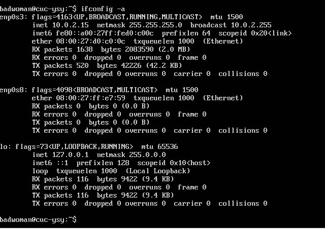

查阅以后得知是因为网卡没启动，需要输入代码启动，这串代码我并不明白什么意思

sudo ifconfig enp0s8 up

sudo dhclient enp0s8

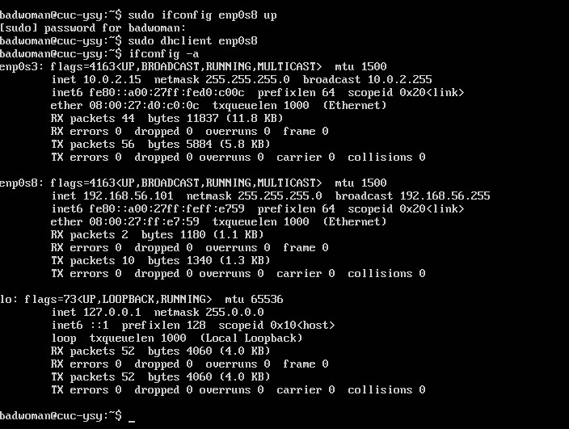

这次成功显示了ip地址

把它输入到putty中

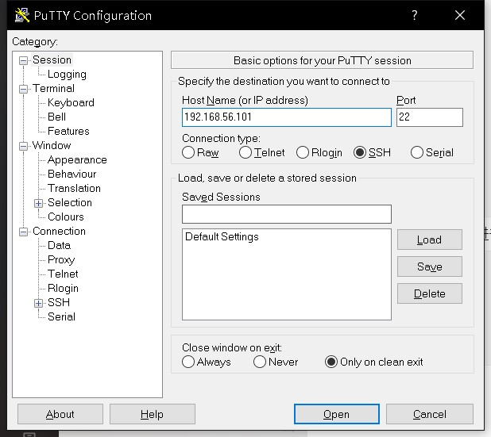

但是打开的时候出问题了。。。

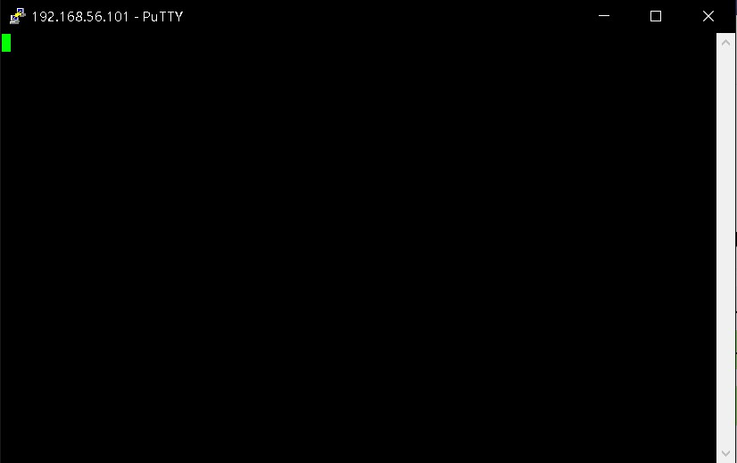

这个问题真的困扰我很久，不知道怎么解决，网络上众说纷纭，最后找到个比较可信的说是ssh服务的问题。

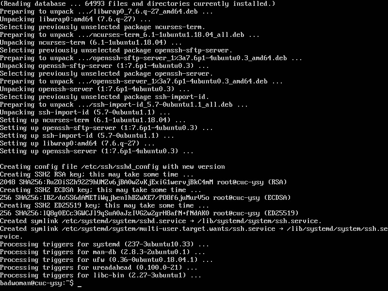

从网上查了如何安装

打开"终端窗口"，输入"sudo apt-get install openssh-server"-->回车-->输入"y"-->回车-->安装完成。

再试试看

连接超时这个问题我用了一晚上加一上午的时间、、直到今天早上才解决掉，网上众说纷纭，最后我发现好像是SSH服务出现了问题，重新下载，安装，又启动，从主机ping了虚拟机，发现有信号回馈。成功连接，这时再次输入ip，终于连接上了。。

期间我以为是装系统时出的问题，所以重新装了一遍Ubuntu，名字改了一下。之后改成了badwoman。

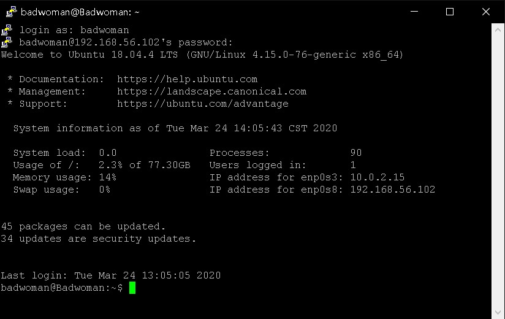

然后点开psftp，，一开始一直黑屏我还有点纳闷怎么回事，原来文字默认也是黑的…

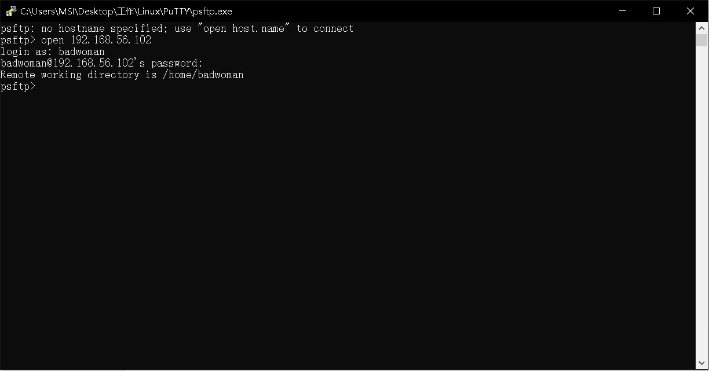

成功连接到了pstfp

接下来按照老师给的代码，创建文件夹，并挂载，但是挂载时有问题，psftp提示没有此功能，所以我问了同学，在virtual box里面进行了操作，，没来得及截图我输入的代码就被顶到上面去了。

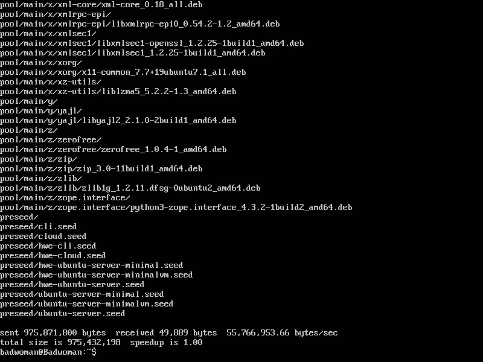

这里是已经同步进去了，我不知道会一下出那么多，，前面没来得及及截图

输完了配置，这里还好理解，就是把选项输入进去，问了人才知道怎么保存。。ESC后:wq！强行退出保存。

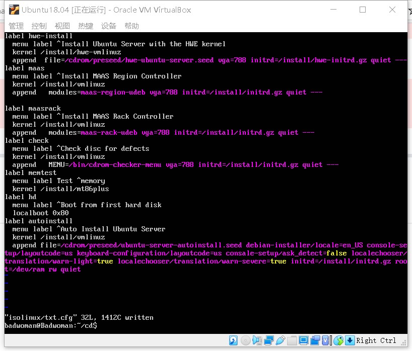

然后修改了timeout为10

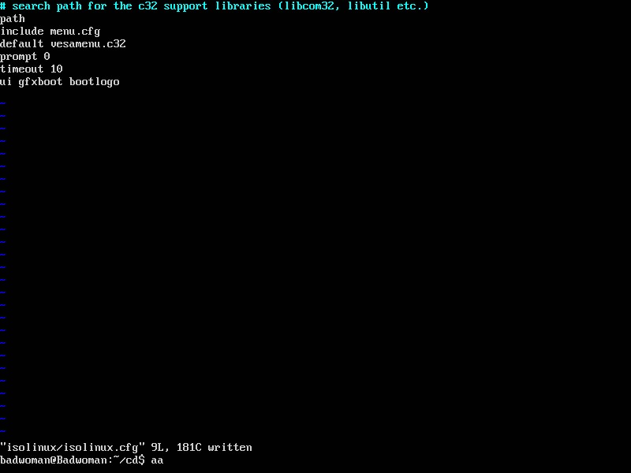

修改了shell文件，但是缺少这个服务，下载好了以后得到解决

下一步创建新的虚拟机搭载custom.iso进行无人值守安装

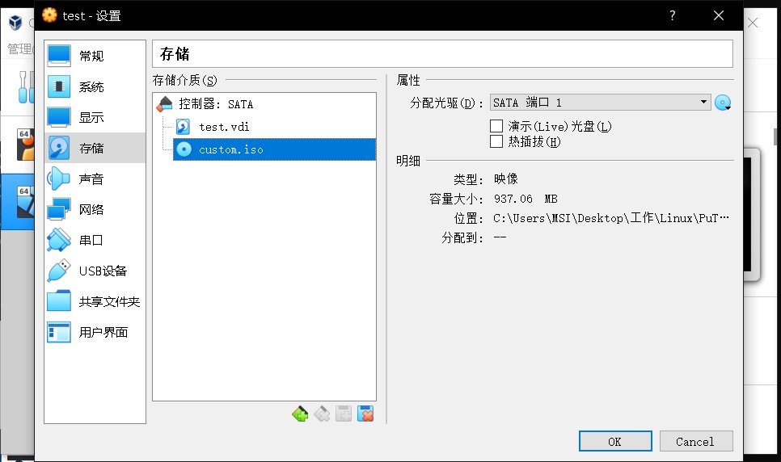

到这步以为做好了，，等着喝茶呢，没想到压根没成功，，根本就没自动安装，不知道哪里出了问题，只能重新再做一次，说实话过程挺痛苦的，因为之前过程中有新建文件夹，又上传，删除，等操作，我不知道哪一步需要重新做，文件究竟有没有修改，所以几乎是一步一步返回去清除了操作，然后重新做了一遍，幸好最后成功了，要么我可能真崩溃了。

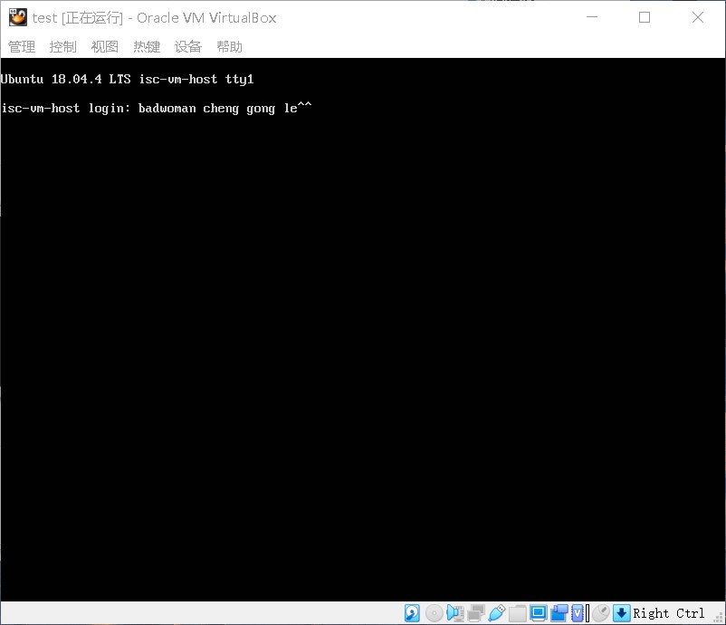

nice!